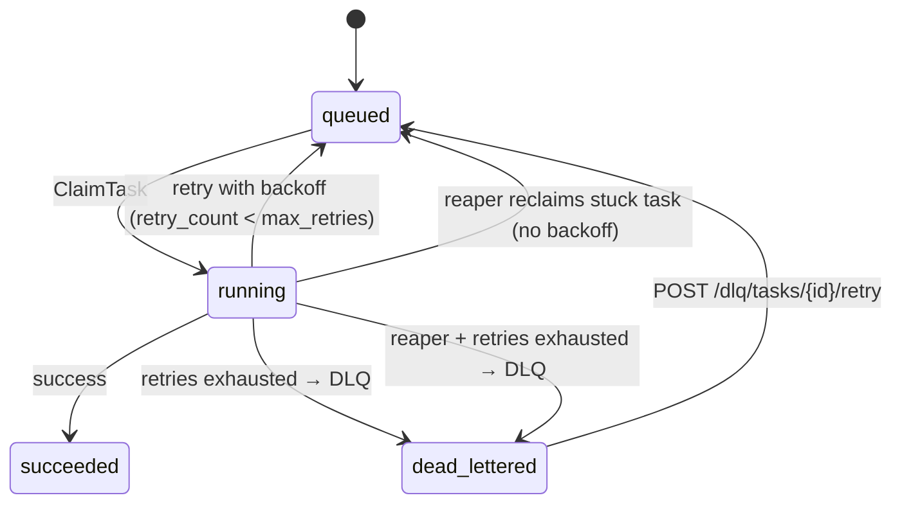
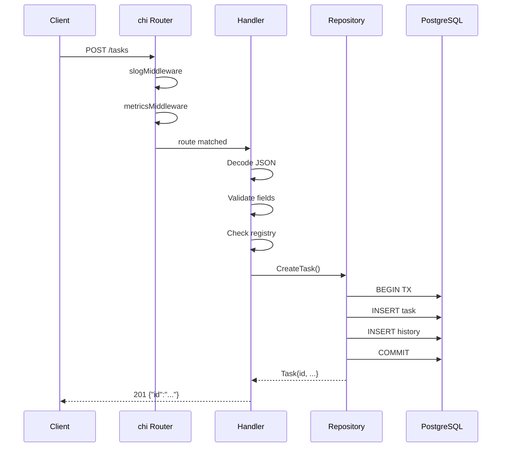
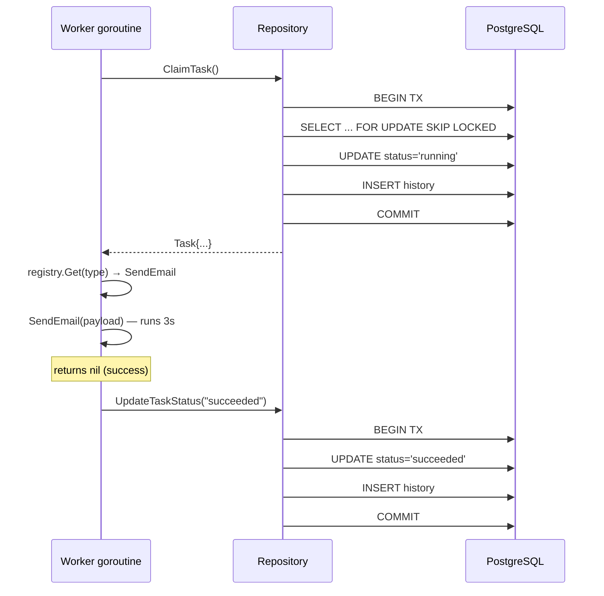

# Task Manager: A Go Guide for Python Developers

This document explains the project's architecture and Go idioms by mapping them to Python equivalents you already know.

---

## Table of Contents

1. [The Big Picture](#the-big-picture)
2. [Go vs Python: Core Concepts](#go-vs-python-core-concepts)
3. [Module System and Project Layout](#module-system-and-project-layout)
4. [Project Walkthrough](#project-walkthrough)
   - [Entry Point](#1-entry-point---cmdservermain-go)
   - [Models](#2-models---internaltaskmodelsgo)
   - [Repository](#3-repository---internaltaskrepositorygo)
   - [Registry](#4-registry---internaltaskregistrygo)
   - [Task Functions](#5-task-functions---pkgemailgo-and-pkgquerygo)
   - [HTTP Layer](#6-http-layer---internalapihandlergo-and-routesgo)
   - [Worker Pool](#7-worker-pool---internalworkerpoolgo)
   - [Database Schema](#8-database-schema---migrations)
5. [Structured Logging with slog](#structured-logging-with-slog)
6. [Dead-Letter Queue (DLQ)](#dead-letter-queue-dlq)
7. [Stuck Task Reaper](#stuck-task-reaper)
8. [Idempotency Keys](#idempotency-keys)
9. [Observability: Prometheus and Grafana](#observability-prometheus-and-grafana)
10. [Graceful Shutdown: Draining and Readiness Probes](#graceful-shutdown-draining-and-readiness-probes)
11. [Concurrency: Goroutines vs Python Threads/Asyncio](#concurrency-goroutines-vs-python)
12. [Error Handling: Go vs Python](#error-handling)
13. [Dependency Injection: No Framework Needed](#dependency-injection)
14. [Testing Patterns](#testing-patterns)
15. [The Full Request Lifecycle](#the-full-request-lifecycle)
16. [Running and Deploying](#running-and-deploying)

---

## The Big Picture

This is a **background task queue** — similar to what you'd build with Celery + Redis/RabbitMQ in Python, but using PostgreSQL as both the database and the queue.

**Python equivalent stack:**

| This project (Go) | Python equivalent |
|---|---|
| `cmd/server/main.go` | `if __name__ == "__main__"` in a Flask/FastAPI app |
| `internal/api/` (chi router) | FastAPI/Flask route handlers |
| `internal/task/repository.go` | SQLAlchemy repository or raw `asyncpg` queries |
| `internal/task/registry.go` | A dict mapping `{"send_email": send_email_func}` |
| `internal/worker/pool.go` | Celery worker process |
| `pkg/email/`, `pkg/query/` | Your actual task functions (Celery tasks) |
| PostgreSQL + `SKIP LOCKED` | Redis/RabbitMQ message queue |
| `prometheus/client_golang` + `/metrics` | `prometheus_client` or `statsd` |
| `deploy/prometheus.yaml` (Prometheus server) | Grafana Cloud / self-hosted Prometheus |
| `deploy/grafana.yaml` + dashboard ConfigMaps | Grafana Cloud dashboards / Datadog dashboards |

The key difference: instead of a separate broker (Redis), tasks live in a PostgreSQL table. Workers claim tasks using `SELECT FOR UPDATE SKIP LOCKED`, which is PostgreSQL's way of saying "give me one unclaimed row and lock it so nobody else grabs it."

---

## Go vs Python: Core Concepts

### Packages vs Modules

```go
// Go: every file starts with its package name
package task                    // this file belongs to the "task" package

import "github.com/google/uuid" // importing an external package
```

```python
# Python equivalent
# The directory name IS the package (like __init__.py)
from uuid import UUID           # importing
```

In Go, all `.go` files in the same directory share the same package name and can access each other's unexported (lowercase) identifiers. There's no `__init__.py` — the directory is the package.

**Capitalization = visibility:**
- `CreateTask` (uppercase) = exported = Python's public method
- `scanTask` (lowercase) = unexported = Python's `_private` convention, but enforced by the compiler

### Structs vs Classes

```go
// Go: struct with JSON tags
type Task struct {
    ID     uuid.UUID         `json:"id"`
    Name   string            `json:"name"`
    Status string            `json:"status"`
}
```

```python
# Python equivalent: dataclass or Pydantic model
@dataclass
class Task:
    id: UUID
    name: str
    status: str
```

The `` `json:"id"` `` backtick annotations are **struct tags** — they tell the JSON encoder/decoder what field names to use. Similar to Pydantic's `Field(alias="id")`.

Go structs have no inheritance. No `class Task(BaseModel)`. Instead, you compose by embedding structs inside other structs.

### Methods

```go
// Go: methods are functions with a "receiver"
func (r *PostgresRepository) GetTask(ctx context.Context, id uuid.UUID) (*Task, error) {
    // r is like "self" in Python
}
```

```python
# Python equivalent
class PostgresRepository:
    def get_task(self, id: UUID) -> Task:
        ...
```

The `(r *PostgresRepository)` before the function name is the **receiver** — it's how Go attaches methods to types. `r` is equivalent to `self`. The `*` means it's a pointer receiver (the method can modify the struct).

### Interfaces vs ABCs / Protocols

This is the most important Go concept in this project:

```go
// Go: interface defines behavior, not inheritance
// internal/task/repository.go
type Repository interface {
    CreateTask(ctx context.Context, req CreateTaskRequest) (*Task, error)
    GetTask(ctx context.Context, id uuid.UUID) (*Task, error)
    GetTaskHistory(ctx context.Context, taskID uuid.UUID) ([]TaskHistory, error)
    ClaimTask(ctx context.Context) (*Task, error)
    UpdateTaskStatus(ctx context.Context, id uuid.UUID, status string) error
    RequeueTask(ctx context.Context, id uuid.UUID) error

    // Dead-letter queue operations
    MoveTaskToDLQ(ctx context.Context, id uuid.UUID, errorMessage string) error
    ListDLQTasks(ctx context.Context) ([]DeadLetterTask, error)
    GetDLQTask(ctx context.Context, id uuid.UUID) (*DeadLetterTask, error)
    RetryDLQTask(ctx context.Context, dlqID uuid.UUID) (*Task, error)

    // Stuck task reaper
    ReapStaleTasks(ctx context.Context) (requeued int, deadLettered int, err error)
}
```

```python
# Python equivalent: Protocol (PEP 544) or ABC
class Repository(Protocol):
    def create_task(self, req: CreateTaskRequest) -> Task: ...
    def get_task(self, id: UUID) -> Task: ...
    def get_task_history(self, task_id: UUID) -> list[TaskHistory]: ...
    def claim_task(self) -> Optional[Task]: ...
    def update_task_status(self, id: UUID, status: str) -> None: ...
    def requeue_task(self, id: UUID) -> None: ...

    # Dead-letter queue operations
    def move_task_to_dlq(self, id: UUID, error_message: str) -> None: ...
    def list_dlq_tasks(self) -> list[DeadLetterTask]: ...
    def get_dlq_task(self, id: UUID) -> DeadLetterTask: ...
    def retry_dlq_task(self, dlq_id: UUID) -> Task: ...

    # Stuck task reaper
    def reap_stale_tasks(self) -> tuple[int, int]: ...
```

**The critical difference:** Go interfaces are **implicit**. `PostgresRepository` doesn't say "I implement Repository" anywhere. If it has all the right methods with the right signatures, it automatically satisfies the interface. This is like Python's duck typing ("if it quacks like a duck..."), but checked at compile time.

This is why you can write a mock `Repository` for tests without touching the real code.

### Pointers

```go
func NewHandler(repo task.Repository, registry *task.Registry, drain *DrainState) *Handler {
    return &Handler{repo: repo, registry: registry, drain: drain}
}
```

The `*` and `&` are about **pointers** — a concept Python hides from you.

- `*Handler` = "a pointer to a Handler" (like a Python reference — you're passing the object itself, not a copy)
- `&Handler{...}` = "create a Handler and give me a pointer to it"
- In Python, everything is already a reference, so you never think about this. In Go, structs are **values** by default (passed by copy), so you use pointers when you want to share or mutate.

**Rule of thumb:** if you see `*` in a function signature, it means "I'm sharing this object, not copying it." Almost all structs in this project use pointers.

### Zero Values

In Python, uninitialized variables don't exist — you get a `NameError`. In Go, every type has a **zero value** that it starts with automatically:

| Go type | Zero value | Python equivalent |
|---|---|---|
| `int` | `0` | N/A (must assign) |
| `string` | `""` | N/A (must assign) |
| `bool` | `false` | N/A (must assign) |
| `*T` (pointer) | `nil` | `None` |
| `[]T` (slice) | `nil` | `None` (not `[]`) |
| `map[K]V` | `nil` | `None` (not `{}`) |
| `sync.RWMutex` | ready to use | `threading.RLock()` (must call constructor) |

This is powerful: in `registry.go:20-22`, the `Registry` struct has a `mu sync.RWMutex` field that works immediately without initialization:

```go
// internal/task/registry.go
type Registry struct {
    mu    sync.RWMutex        // zero value is an unlocked, usable mutex
    funcs map[string]TaskFunc // zero value is nil — must initialize with make()
}
```

In Python, you'd need `self._lock = threading.RLock()` in `__init__`. In Go, the mutex is usable from its zero value. But note: `funcs` (a map) still needs `make()` because a nil map panics on write.

### `:=` vs `var`

Go has two ways to declare variables:

```go
// := (short declaration) — infers the type from the right-hand side
concurrency, _ := strconv.Atoi(envOrDefault("WORKER_CONCURRENCY", "4"))  // main.go:28

// var — explicit type, starts at zero value
var req task.CreateTaskRequest  // handler.go:126 — declares an empty struct to decode into
```

```python
# Python equivalent
concurrency = int(os.getenv("WORKER_CONCURRENCY", "4"))

req = CreateTaskRequest()  # or just declare inline
```

Use `:=` when you have a value to assign immediately (the common case). Use `var` when you want the zero value as a starting point — like `var req` which creates an empty struct that `json.Decode` will fill in.

### The Blank Identifier `_`

Go requires you to use every declared variable — unused variables are a compile error. The blank identifier `_` lets you explicitly discard a value:

```go
// main.go:28 — we don't care if Atoi fails; concurrency defaults to 4 below
concurrency, _ := strconv.Atoi(envOrDefault("WORKER_CONCURRENCY", "4"))
```

```python
# Python equivalent — you'd just ignore the exception
try:
    concurrency = int(os.getenv("WORKER_CONCURRENCY", "4"))
except ValueError:
    concurrency = 4
```

You'll see `_` in `for` loops too: `for _, item := range slice` discards the index (like Python's `for item in list`), and `for i, _ := range slice` discards the value (like `for i in range(len(list))`).

### Explicit Type Conversions

Go never converts between types implicitly — even `int` to `float64` requires an explicit cast. Python happily promotes `3 + 0.5` to `3.5`; Go would refuse to compile.

```go
// pool.go:160 — int64 → time.Duration requires explicit conversion
jitter := time.Duration(rand.Int63n(int64(500 * time.Millisecond)))

// handler.go:349 — int → string via strconv (not a simple cast!)
status := strconv.Itoa(sw.status)
```

```python
# Python — implicit conversions happen automatically
jitter = random.random() * 0.5  # int * float → float, no cast needed

# int → str is explicit in Python too
status = str(response.status_code)
```

Key gotcha: `string(65)` in Go gives you `"A"` (the Unicode character), not `"65"`. Use `strconv.Itoa(65)` for the number-to-string conversion you'd expect.

### Slices (Go's Lists)

Go slices are the equivalent of Python lists — dynamic, ordered, zero-indexed:

```go
// handler.go:230 — initialize an empty slice (not nil) for JSON serialization
if tasks == nil {
    tasks = []task.DeadLetterTask{}  // ensures JSON output is [] not null
}

// repository.go:198-204 — build a slice dynamically with append
var history []TaskHistory            // nil slice (like None, but append works on it)
for rows.Next() {
    var h TaskHistory
    // ... scan row ...
    history = append(history, h)     // like Python's list.append()
}
```

```python
# Python equivalent
if tasks is None:
    tasks = []

history: list[TaskHistory] = []
for row in cursor:
    history.append(TaskHistory(**row))
```

Key differences from Python lists:
- Slices are **typed** — `[]TaskHistory` can only hold `TaskHistory` values
- `append()` returns a new slice (you must reassign: `s = append(s, item)`)
- A `nil` slice and an empty slice (`[]T{}`) behave the same for `len()`, `append()`, and `range`, but serialize to JSON differently (`null` vs `[]`)

### `make()` — Initializing Composite Types

Go's `make()` function initializes maps, slices, and channels. Maps and channels **must** be initialized with `make()` before use — a nil map panics on write, and a nil channel blocks forever:

```go
// registry.go:28 — maps require make()
funcs: make(map[string]TaskFunc)

// pool.go:113 — channels require make()
done := make(chan struct{})
```

```python
# Python equivalent — constructors do this for you
funcs = {}           # dict literal
done = asyncio.Event()  # closest equivalent to a signaling channel
```

You don't need `make()` for slices if you're going to use `append()` — a nil slice works fine with `append`. But if you need a pre-allocated slice, use `make([]T, length, capacity)`.

### `range` — Iterating Over Collections

Go's `range` keyword iterates over slices, maps, strings, and channels. It always returns two values — the index/key and the value:

```go
// registry_test.go:30-42 — ranging over a slice of test cases
for _, tt := range tests {     // _ discards index, tt is the value
    t.Run(tt.name, func(t *testing.T) {
        t.Parallel()
        fn, ok := r.Get(tt.taskType)
        // ...
    })
}
```

```python
# Python equivalent
for tt in tests:               # Python doesn't give you the index by default
    # use the test case...

# If you need the index:
for i, tt in enumerate(tests): # Go: for i, tt := range tests
```

| Go range form | Python equivalent |
|---|---|
| `for i, v := range slice` | `for i, v in enumerate(list)` |
| `for _, v := range slice` | `for v in list` |
| `for i := range slice` | `for i in range(len(list))` |
| `for k, v := range myMap` | `for k, v in my_dict.items()` |

### String Formatting

Go uses `fmt.Sprintf` for string formatting (no f-strings):

```go
// registry.go:62 — %q adds quotes around the string
panic(fmt.Sprintf("task %q not found in registry", name))
// Output: task "unknown_type" not found in registry

// repository.go:131 — %w wraps an error (special to fmt.Errorf)
return nil, fmt.Errorf("CreateTask: marshal payload: %w", err)

// main.go:68 — %s for plain strings
Addr: fmt.Sprintf(":%s", serverPort)
```

```python
# Python equivalents
raise RuntimeError(f"task {name!r} not found in registry")  # !r adds quotes like %q

raise TaskError(f"CreateTask: marshal payload") from err     # error wrapping

addr = f":{server_port}"
```

Common format verbs: `%s` (string), `%d` (integer), `%v` (any value, default format), `%q` (quoted string), `%w` (error wrapping, only in `fmt.Errorf`), `%T` (type name for debugging).

### Time and Duration

Go's `time.Duration` is a distinct type (an `int64` of nanoseconds). You can't mix integers and durations without explicit conversion:

```go
// main.go:70-72 — multiplying a constant by a Duration is fine
ReadTimeout:  5 * time.Second     // time.Duration * time.Duration = time.Duration
WriteTimeout: 10 * time.Second

// pool.go:196 — but a variable int needs explicit conversion
timeout := time.Duration(t.TimeoutSeconds) * time.Second
// Can't write: t.TimeoutSeconds * time.Second  ← compile error!
```

```python
# Python equivalent — timedelta accepts plain numbers
from datetime import timedelta
read_timeout = timedelta(seconds=5)

# No conversion needed for variables
timeout = timedelta(seconds=task.timeout_seconds)
```

Why the explicit conversion? Go prevents accidental unit mismatches. `time.Duration(5)` is 5 nanoseconds, not 5 seconds. You must multiply by `time.Second` to get the right scale. This catches bugs like `time.Sleep(5)` (sleeps 5 nanoseconds, not 5 seconds).

### The Comma-Ok Idiom

Go uses a two-value return to indicate presence/absence — no `KeyError` exceptions, no `None` sentinels:

```go
// registry.go:46-49 — map lookup returns (value, bool)
fn, ok := r.funcs[name]
if !ok {
    return nil, false    // "name" not in map
}
return fn, true
```

```python
# Python equivalents
fn = registry.get(name)       # returns None if missing
if fn is None:
    return None, False

# Or with EAFP:
try:
    fn = registry[name]       # raises KeyError if missing
except KeyError:
    return None, False
```

The comma-ok pattern appears in two main places:
- **Map lookups**: `val, ok := myMap[key]` — `ok` is `false` if the key doesn't exist
- **Type assertions**: `val, ok := x.(MyType)` — `ok` is `false` if `x` isn't that type

Without the `, ok`, a missing map key returns the zero value silently, and a failed type assertion panics. Always use the two-value form when the key might not exist.

---

## Module System and Project Layout

### `go.mod` — The Project Manifest

Every Go project has a `go.mod` file at its root — it's the equivalent of Python's `pyproject.toml` or `requirements.txt`:

```
// go.mod
module github.com/giulio/task-manager   // the module path (like a Python package name)

go 1.24.3                                // minimum Go version required

require (
    github.com/go-chi/chi/v5 v5.2.5                              // HTTP router
    github.com/jackc/pgx/v5 v5.8.0                               // PostgreSQL driver
    github.com/prometheus/client_golang v1.23.2                   // Prometheus metrics
    github.com/testcontainers/testcontainers-go v0.40.0          // integration testing
    // ... more dependencies
)
```

```python
# Python equivalent: pyproject.toml
[project]
name = "task-manager"
requires-python = ">=3.12"

[project.dependencies]
fastapi = ">=0.100"
asyncpg = ">=0.29"
prometheus-client = ">=0.20"
testcontainers = ">=4.0"
```

The module path (`github.com/giulio/task-manager`) is used in every `import` statement throughout the project. When you see `import "github.com/giulio/task-manager/internal/task"`, Go resolves that to the `internal/task/` directory within this module.

### `go.sum` — Dependency Lock File

`go.sum` contains cryptographic hashes for every dependency — like Python's `poetry.lock` or `pip freeze` output but with SHA-256 checksums for integrity verification. You never edit it manually; `go mod tidy` updates it.

| Go command | Python equivalent | What it does |
|---|---|---|
| `go get github.com/foo/bar` | `pip install foo-bar` | Add a dependency |
| `go mod tidy` | `pip freeze > requirements.txt` | Sync deps with imports |
| `go mod download` | `pip install -r requirements.txt` | Download all deps |

### The `internal/` Directory — Compiler-Enforced Privacy

This is unique to Go and has no true Python equivalent. Code inside `internal/` **cannot be imported by other Go modules**. The compiler enforces this — it's not just a convention like Python's `_private` prefix.

```
github.com/giulio/task-manager/
├── internal/           ← PRIVATE: only this module can import these
│   ├── api/            # HTTP handlers, routes, errors
│   ├── task/           # models, repository interface, registry
│   └── worker/         # worker pool
├── pkg/                ← PUBLIC: other modules could import these
│   ├── email/          # send_email task function
│   └── query/          # run_query task function
├── cmd/                ← Entry points (main packages)
│   └── server/
│       └── main.go
└── go.mod
```

```python
# Python equivalent — convention only, not enforced
task_manager/
├── _internal/          # leading underscore = "please don't import this"
│   ├── api/
│   ├── task/
│   └── worker/
├── email/              # public modules
└── query/
```

In this project, `internal/task/`, `internal/api/`, and `internal/worker/` contain implementation details. `pkg/email/` and `pkg/query/` contain the task function implementations — these use the `pkg/` convention (public, reusable code) because their signatures conform to `TaskFunc` and could theoretically be used by other projects.

---

## Project Walkthrough

### 1. Entry Point — `cmd/server/main.go`

```go
func main() {
    // 1. Read config from environment
    databaseURL := envOrDefault("DATABASE_URL", "postgres://...")
    concurrency, _ := strconv.Atoi(envOrDefault("WORKER_CONCURRENCY", "4"))
    reapIntervalSeconds, _ := strconv.Atoi(envOrDefault("REAPER_INTERVAL_SECONDS", "30"))

    // 2. Connect to PostgreSQL
    pool, err := pgxpool.New(ctx, databaseURL)

    // 3. Wire dependencies together (no framework!)
    repo := task.NewPostgresRepository(pool)    // implements Repository interface
    registry := task.NewRegistry()               // maps "send_email" -> function
    drain := api.NewDrainState()                 // shutdown readiness flag
    handler := api.NewHandler(repo, registry, drain)  // HTTP handlers
    router := api.NewRouter(handler)             // chi routes

    // 4. Start worker pool + reaper (background goroutines)
    reapInterval := time.Duration(reapIntervalSeconds) * time.Second
    wp := worker.NewPool(repo, registry, concurrency, reapInterval)
    wp.Start(ctx)

    // 5. Start HTTP server
    srv := &http.Server{Addr: ":8080", Handler: router}
    srv.ListenAndServe()
}
```

**Python equivalent:**
```python
if __name__ == "__main__":
    pool = asyncpg.create_pool(DATABASE_URL)
    repo = PostgresRepository(pool)
    registry = {"send_email": send_email, "run_query": run_query}

    # Start Celery workers (in this project, they're in-process goroutines instead)
    worker_pool = WorkerPool(repo, registry, concurrency=4)
    worker_pool.start()

    # Start FastAPI
    app = create_app(repo, registry)
    uvicorn.run(app, port=8080)
```

The key insight: **everything runs in one process**. The HTTP server and the worker pool share the same database connection pool. In Python/Celery, you'd typically run `uvicorn` and `celery worker` as separate processes.

### 2. Models — `internal/task/models.go`

```go
type Task struct {
    ID             uuid.UUID         `json:"id"`
    Name           string            `json:"name"`
    Type           string            `json:"type"`
    Payload        map[string]string `json:"payload"`
    Status         string            `json:"status"`
    Priority       int               `json:"priority"`
    RetryCount     int               `json:"retry_count"`
    MaxRetries     int               `json:"max_retries"`
    TimeoutSeconds int               `json:"timeout_seconds"`
    IdempotencyKey *string           `json:"idempotency_key,omitempty"`
    CreatedAt      time.Time         `json:"created_at"`
    UpdatedAt      time.Time         `json:"updated_at"`
    RunAfter       time.Time         `json:"run_after"`
}
```

This is a plain data struct -- no methods, no behavior. The `json` tags mean you can do `json.Marshal(task)` and it produces `{"id": "...", "name": "...", ...}` automatically (like Pydantic's `.model_dump_json()`).

`map[string]string` is Go's typed dict -- equivalent to Python's `Dict[str, str]`. Go maps must declare their key and value types upfront.

**`*string` for nullable optional fields:** `IdempotencyKey` is `*string` (a pointer to a string), not `string`. This is Go's way of representing a nullable field -- the zero value of `*string` is `nil`, which serializes to JSON `null` and maps to SQL `NULL`. A plain `string` can only be `""` (empty), with no way to distinguish "not provided" from "provided as empty." The `omitempty` tag makes JSON output cleaner by omitting the field entirely when nil. In the corresponding `CreateTaskRequest`, the field is a plain `string` because the request uses `""` to mean "not provided" and the repository converts that to SQL `NULL`.

```python
# Python equivalent -- Optional[str] with Pydantic
class Task(BaseModel):
    idempotency_key: str | None = None   # None = not set, "" = explicit empty

class CreateTaskRequest(BaseModel):
    idempotency_key: str = ""            # "" means "not provided"
```

The codebase also defines a `DeadLetterTask` struct for tasks that exhausted all retries:

```go
// internal/task/models.go
type DeadLetterTask struct {
    ID                uuid.UUID         `json:"id"`
    OriginalTaskID    uuid.UUID         `json:"original_task_id"`
    Name              string            `json:"name"`
    Type              string            `json:"type"`
    Payload           map[string]string `json:"payload"`
    Priority          int               `json:"priority"`
    RetryCount        int               `json:"retry_count"`
    MaxRetries        int               `json:"max_retries"`
    TimeoutSeconds    int               `json:"timeout_seconds"`
    ErrorMessage      string            `json:"error_message"`
    OriginalCreatedAt time.Time         `json:"original_created_at"`
    DeadLetteredAt    time.Time         `json:"dead_lettered_at"`
}
```

Notice that `DeadLetterTask` is a separate struct, not a subclass of `Task`. Go has no inheritance -- you define a new struct with the fields you need. In Python you might reach for `class DeadLetterTask(Task)` with extra fields, but Go favors explicit, flat types. Both structs are plain data; JSON serialization comes from the struct tags.

### 3. Repository — `internal/task/repository.go`

This is where the database magic happens. Here's the most interesting method:

```go
func (r *PostgresRepository) ClaimTask(ctx context.Context) (*Task, error) {
    tx, err := r.pool.Begin(ctx)        // START TRANSACTION
    defer tx.Rollback(ctx)               // auto-rollback if we don't commit

    row := tx.QueryRow(ctx,
        `SELECT ... FROM tasks
         WHERE status = 'queued'
         ORDER BY priority DESC, created_at ASC
         LIMIT 1
         FOR UPDATE SKIP LOCKED`)        // <-- the magic

    t, err := scanTask(row)
    if errors.Is(err, pgx.ErrNoRows) {
        return nil, nil                   // no tasks available, not an error
    }

    tx.Exec(ctx, `UPDATE tasks SET status = 'running' WHERE id = $1`, t.ID)
    tx.Exec(ctx, `INSERT INTO task_history (task_id, status) VALUES ($1, 'running')`, t.ID)

    tx.Commit(ctx)
    return t, nil
}
```

**`SELECT FOR UPDATE SKIP LOCKED` explained:**
- `FOR UPDATE` = lock this row so nobody else can modify it while I'm in this transaction
- `SKIP LOCKED` = if the row is already locked by another worker, skip it and give me the next one
- Together, they let multiple workers safely grab different tasks concurrently without conflicts

**Python equivalent with asyncpg:**
```python
async def claim_task(self, pool):
    async with pool.acquire() as conn:
        async with conn.transaction():
            row = await conn.fetchrow("""
                SELECT * FROM tasks
                WHERE status = 'queued'
                ORDER BY priority DESC, created_at ASC
                LIMIT 1
                FOR UPDATE SKIP LOCKED
            """)
            if not row:
                return None
            await conn.execute("UPDATE tasks SET status = 'running' WHERE id = $1", row['id'])
            await conn.execute("INSERT INTO task_history ...", row['id'], 'running')
            return Task(**row)
```

**The `defer` pattern:**
```go
tx, _ := r.pool.Begin(ctx)
defer tx.Rollback(ctx)   // runs when function returns, no matter what
// ... do work ...
tx.Commit(ctx)            // if commit succeeds, rollback is a no-op
```

This is Go's version of Python's context manager:
```python
async with conn.transaction():  # auto-rollback on exception
    ...
```

`defer` schedules a function call to run when the enclosing function returns — whether it returns normally or due to an error. It's used everywhere in Go for cleanup (closing files, releasing locks, rolling back transactions).

### 4. Registry — `internal/task/registry.go`

```go
type TaskFunc func(ctx context.Context, params map[string]string) error

type Registry struct {
    mu    sync.RWMutex            // protects concurrent access
    funcs map[string]TaskFunc     // "send_email" -> function
}
```

**Python equivalent:**
```python
TaskFunc = Callable[[dict[str, str]], None]

class Registry:
    def __init__(self):
        self._lock = threading.RLock()
        self._funcs: dict[str, TaskFunc] = {}
```

The `sync.RWMutex` is a **read-write lock** — multiple goroutines can read simultaneously (`RLock`/`RUnlock`), but only one can write (`Lock`/`Unlock`). Python's `threading.RLock()` is similar but doesn't distinguish readers from writers.

`TaskFunc` is a **function type** — it says "any function with this exact signature can be used as a task." In Python you'd express this with `Callable` or a `Protocol`.

The registry is pre-loaded with two task types:
```go
func NewRegistry() *Registry {
    r := &Registry{funcs: make(map[string]TaskFunc)}
    r.funcs["send_email"] = email.SendEmail   // function reference, not a call
    r.funcs["run_query"] = query.RunQuery
    return r
}
```

Python equivalent: `registry = {"send_email": send_email, "run_query": run_query}`

### 5. Task Functions — `pkg/email.go` and `pkg/query.go`

```go
func SendEmail(ctx context.Context, params map[string]string) error {
    slog.InfoContext(ctx, "sending email", "to", params["to"])

    select {
    case <-ctx.Done():           // if someone cancels us
        return ctx.Err()
    case <-time.After(3 * time.Second):  // simulate work
    }

    return nil                   // nil = no error = success
}
```

**Python equivalent:**
```python
async def send_email(params: dict[str, str]) -> None:
    logger.info(f"sending email to {params['to']}")
    await asyncio.sleep(3)       # simulate work
    # no return = success; raise Exception for failure
```

The `select` statement is Go-specific — it waits on multiple **channels** simultaneously and proceeds with whichever one fires first. Here it's saying: "either the context gets cancelled, or 3 seconds pass — whichever comes first."

`ctx.Done()` is a channel that closes when the context is cancelled (timeout, shutdown signal, etc.). This is how Go propagates cancellation — similar to Python's `asyncio.CancelledError` but explicit.

The `run_query` function is identical but randomly fails 20% of the time to simulate transient errors.

### 6. HTTP Layer — `internal/api/handler.go` and `routes.go`

```go
// internal/api/routes.go -- Routes (like Flask/FastAPI route decorators)
func NewRouter(h *Handler) chi.Router {
    r := chi.NewRouter()
    r.Use(slogMiddleware)        // logging middleware
    r.Use(metricsMiddleware)     // Prometheus middleware

    // Infrastructure endpoints.
    r.Get("/health", h.HealthCheck)
    r.Get("/ready", h.ReadinessCheck)
    r.Handle("/metrics", promhttp.Handler())

    // Task endpoints.
    r.Post("/tasks", h.CreateTask)
    r.Get("/tasks/{id}", h.GetTask)
    r.Get("/tasks/{id}/history", h.GetTaskHistory)

    // Dead-letter queue endpoints.
    r.Get("/dlq/tasks", h.ListDLQTasks)
    r.Get("/dlq/tasks/{id}", h.GetDLQTask)
    r.Post("/dlq/tasks/{id}/retry", h.RetryDLQTask)

    return r
}
```

**Python equivalent:**
```python
app = FastAPI()
app.middleware("http")(logging_middleware)
app.middleware("http")(metrics_middleware)

@app.post("/tasks", status_code=201)
async def create_task(req: CreateTaskRequest): ...

@app.get("/tasks/{id}")
async def get_task(id: UUID): ...

# Dead-letter queue endpoints
@app.get("/dlq/tasks")
async def list_dlq_tasks(): ...

@app.get("/dlq/tasks/{id}")
async def get_dlq_task(id: UUID): ...

@app.post("/dlq/tasks/{id}/retry")
async def retry_dlq_task(id: UUID): ...
```

**Middleware** in Go is a function that wraps an HTTP handler:
```go
func slogMiddleware(next http.Handler) http.Handler {
    return http.HandlerFunc(func(w http.ResponseWriter, r *http.Request) {
        start := time.Now()
        next.ServeHTTP(w, r)  // call the actual handler
        slog.Info("request completed", "duration", time.Since(start))
    })
}
```

This is exactly like Python ASGI middleware or a decorator:
```python
@app.middleware("http")
async def log_middleware(request, call_next):
    start = time.time()
    response = await call_next(request)
    logger.info(f"request completed in {time.time() - start}s")
    return response
```

**Handler methods** follow Go's `http.HandlerFunc` signature — `(w http.ResponseWriter, r *http.Request)`:
- `w` = where you write the response (like Flask's `return jsonify(...)`)
- `r` = the incoming request (like FastAPI's `request: Request`)

Go doesn't have automatic request parsing like FastAPI. You manually decode JSON:
```go
var req task.CreateTaskRequest
json.NewDecoder(r.Body).Decode(&req)   // &req = pointer, so Decode fills it in
```

vs Python:
```python
@app.post("/tasks")
async def create_task(req: CreateTaskRequest):  # FastAPI does this automatically
```

### 7. Worker Pool — `internal/worker/pool.go`

This is the most complex part. Each worker is a **goroutine** (lightweight thread) running an infinite loop:

```go
func (p *Pool) run(ctx context.Context, workerID int) {
    for {
        // 1. Check if we should shut down
        select {
        case <-ctx.Done():
            return
        default:
        }

        // 2. Try to claim a task from the database
        t, err := p.repo.ClaimTask(ctx)
        if t == nil {
            // nothing to do — sleep with jitter and retry
            time.Sleep(1*time.Second + randomJitter)
            continue
        }

        // 3. Look up the function for this task type
        fn, ok := p.registry.Get(t.Type)   // "send_email" -> SendEmail function

        // 4. Execute with a timeout
        taskCtx, cancel := context.WithTimeout(ctx, timeout)
        err = fn(taskCtx, t.Payload)         // actually run the task
        cancel()

        // 5. Handle result
        if err != nil {
            p.handleFailure(ctx, t, ...)     // retry or move to DLQ
        } else {
            p.handleSuccess(ctx, t, ...)     // mark succeeded
        }
    }
}
```

**Python equivalent (simplified Celery worker):**
```python
class Worker:
    def run(self):
        while not self.should_stop:
            task = self.repo.claim_task()
            if task is None:
                time.sleep(1 + random.random() * 0.5)
                continue

            fn = self.registry[task.type]

            try:
                fn(task.payload)       # run the task
                self.repo.update_status(task.id, "succeeded")
            except Exception as e:
                if task.retry_count < task.max_retries:
                    self.repo.requeue(task.id)
                else:
                    # Go version moves to DLQ instead of just marking "failed"
                    self.repo.move_task_to_dlq(task.id, str(e))
```

When retries are exhausted, the worker calls `MoveTaskToDLQ` (not `UpdateTaskStatus("failed")`). This copies the task snapshot into the `dead_letter_queue` table with the final error message, sets the original task's status to `"dead_lettered"`, and records the transition in `task_history` -- all in one transaction. The worker also increments the `worker_dlq_tasks_depth` Prometheus gauge.

```go
// internal/worker/pool.go -- handleFailure (retry exhausted path)
status := "dead_lettered"

taskDurationSeconds.WithLabelValues(t.Type, status).Observe(duration.Seconds())
tasksProcessedTotal.WithLabelValues(t.Type, status).Inc()
dlqTasksDepth.Inc()

if err := p.repo.MoveTaskToDLQ(ctx, t.ID, taskErr.Error()); err != nil {
    slog.Error("failed to move task to DLQ", "task_id", t.ID, "error", err, "worker_id", workerID)
    return
}
```

**Retry backoff:** When `RequeueTask` is called, the database sets `run_after` to a future timestamp using exponential backoff (`5s * 2^retry_count`, capped at 5 minutes). The worker pool code itself is unchanged -- the delay is enforced entirely in SQL. The `ClaimTask` query's `WHERE status = 'queued' AND run_after <= now()` clause ensures workers skip tasks that aren't ready yet. This is analogous to Celery's `self.retry(countdown=...)` but implemented at the database level rather than the broker level.

The pool starts N worker goroutines plus a single **reaper** goroutine:
```go
// internal/worker/pool.go
func (p *Pool) Start(ctx context.Context) {
    for i := 0; i < p.concurrency; i++ {
        p.wg.Add(1)
        go func(workerID int) {   // "go" launches a goroutine
            defer p.wg.Done()
            p.run(ctx, workerID)
        }(i)
    }

    if p.reapInterval > 0 {
        p.wg.Add(1)
        go func() {
            defer p.wg.Done()
            p.reap(ctx)           // stuck-task reaper (see "Stuck Task Reaper" section)
        }()
    }
}
```

`go func()` is the Go keyword for "run this function concurrently." It's like `threading.Thread(target=fn).start()` in Python, but goroutines are much cheaper -- you can run thousands without issues. The reaper is just another goroutine in the same `WaitGroup`, so graceful shutdown waits for it too.

### 8. Database Schema — `migrations/`

**Migration 001** (`migrations/001_create_tables.up.sql`):

```sql
CREATE TABLE tasks (
    id              UUID        PRIMARY KEY DEFAULT gen_random_uuid(),
    name            TEXT        NOT NULL,
    type            TEXT        NOT NULL,
    payload         JSONB       NOT NULL DEFAULT '{}',
    status          TEXT        NOT NULL DEFAULT 'queued',
    priority        INT         NOT NULL DEFAULT 0,
    retry_count     INT         NOT NULL DEFAULT 0,
    max_retries     INT         NOT NULL DEFAULT 3,
    timeout_seconds INT         NOT NULL DEFAULT 30,
    created_at      TIMESTAMPTZ NOT NULL DEFAULT now(),
    updated_at      TIMESTAMPTZ NOT NULL DEFAULT now()
);

-- This partial index only covers queued tasks, making the worker's
-- claim query fast even when the table has millions of succeeded rows.
CREATE INDEX idx_tasks_claim ON tasks (priority DESC, created_at ASC)
    WHERE status = 'queued';
```

The **partial index** (`WHERE status = 'queued'`) is worth understanding: it only indexes rows where `status = 'queued'`, so succeeded/failed tasks don't slow down the workers' polling query. As the table grows with millions of succeeded tasks, the index stays small.

**Migration 002** (`migrations/002_create_dead_letter_queue.up.sql`):

```sql
CREATE TABLE dead_letter_queue (
    id                  UUID        PRIMARY KEY DEFAULT gen_random_uuid(),
    original_task_id    UUID        NOT NULL REFERENCES tasks(id),
    name                TEXT        NOT NULL,
    type                TEXT        NOT NULL,
    payload             JSONB       NOT NULL DEFAULT '{}',
    priority            INT         NOT NULL DEFAULT 0,
    retry_count         INT         NOT NULL DEFAULT 0,
    max_retries         INT         NOT NULL DEFAULT 3,
    timeout_seconds     INT         NOT NULL DEFAULT 30,
    error_message       TEXT        NOT NULL DEFAULT '',
    original_created_at TIMESTAMPTZ NOT NULL,
    dead_lettered_at    TIMESTAMPTZ NOT NULL DEFAULT now()
);

CREATE INDEX idx_dlq_dead_lettered_at ON dead_letter_queue (dead_lettered_at DESC);
CREATE INDEX idx_dlq_type ON dead_letter_queue (type);
```

The `dead_letter_queue` table stores a snapshot of the original task at the time it was dead-lettered, plus the `error_message` from the final failure. The `original_task_id` foreign key links back to the `tasks` table for audit trail continuity. In Python/Celery, dead-lettered messages typically go to a separate Redis list or RabbitMQ DLX exchange -- here, everything stays in PostgreSQL.

**Migration 003** (`migrations/003_add_run_after.up.sql`):

```sql
ALTER TABLE tasks ADD COLUMN run_after TIMESTAMPTZ NOT NULL DEFAULT now();
```

This adds exponential backoff for task retries. When a task is requeued, `run_after` is set to `now() + 5s * 2^retry_count` (capped at 5 minutes). Workers only claim tasks where `run_after <= now()`, preventing thundering-herd retries when a downstream service is temporarily down.

**Python/Celery equivalent:** This is similar to Celery's `self.retry(countdown=backoff_seconds)` parameter, which delays the retry message by a specified number of seconds. The difference is that Celery uses the broker's delayed message feature, while here the delay is enforced by a SQL `WHERE` clause on the timestamp column.

**Migration 004** (`migrations/004_add_reaper_and_idempotency.up.sql`):

```sql
-- Partial index for the reaper: efficiently finds tasks stuck in "running".
CREATE INDEX idx_tasks_stuck ON tasks (updated_at ASC) WHERE status = 'running';

-- Optional caller-supplied idempotency key for deduplication.
ALTER TABLE tasks ADD COLUMN idempotency_key TEXT;

-- Partial unique index: only non-NULL keys are checked for uniqueness.
CREATE UNIQUE INDEX idx_tasks_idempotency_key ON tasks (idempotency_key) WHERE idempotency_key IS NOT NULL;
```

This migration adds support for two features:

1. **Stuck task reaper** -- the partial index `idx_tasks_stuck` covers only rows with `status = 'running'`, making the reaper's periodic scan fast without bloating the index with completed tasks.

2. **Idempotency keys** -- the `idempotency_key` column is nullable `TEXT`. The **partial unique index** (`WHERE idempotency_key IS NOT NULL`) enforces uniqueness only for non-NULL values, so tasks without an idempotency key (the common case) don't participate in the uniqueness check at all. This is a PostgreSQL-specific pattern that Python developers may not have seen.

**Python/SQLAlchemy equivalent of the partial unique index:**
```python
# SQLAlchemy partial index
from sqlalchemy import Index

Index(
    "idx_tasks_idempotency_key",
    Task.idempotency_key,
    unique=True,
    postgresql_where=Task.idempotency_key.isnot(None),
)
```

---

## Structured Logging with slog

Go 1.21 introduced `log/slog` in the standard library — structured, leveled logging with no external dependencies. If you've used Python's `structlog` or `python-json-logger`, this will feel familiar.

### Setup

The project configures JSON logging in a single line at startup:

```go
// cmd/server/main.go:23
slog.SetDefault(slog.New(slog.NewJSONHandler(os.Stdout, nil)))
```

This sets the global logger to output JSON to stdout. Every `slog.Info(...)` call after this produces a JSON line like:

```json
{"time":"2026-02-27T10:30:00Z","level":"INFO","msg":"connected to database"}
```

```python
# Python equivalent
import logging, json_log_formatter

handler = logging.StreamHandler()
handler.setFormatter(json_log_formatter.JSONFormatter())
logging.basicConfig(handlers=[handler], level=logging.INFO)
```

### Key-Value Pairs

slog uses alternating key-value arguments after the message — no format strings, no dicts:

```go
// cmd/server/main.go:64
slog.Info("worker pool started", "concurrency", concurrency)
// → {"level":"INFO","msg":"worker pool started","concurrency":4}

// internal/worker/pool.go:167
slog.Info("task claimed", "task_id", t.ID, "type", t.Type, "worker_id", workerID)
// → {"level":"INFO","msg":"task claimed","task_id":"abc-123","type":"send_email","worker_id":0}
```

```python
# Python equivalent with structlog
import structlog
logger = structlog.get_logger()
logger.info("worker pool started", concurrency=concurrency)
logger.info("task claimed", task_id=t.id, type=t.type, worker_id=worker_id)

# Or with stdlib logging + extra dict
logging.info("worker pool started", extra={"concurrency": concurrency})
```

### Context-Aware Logging

`slog.InfoContext(ctx, ...)` passes the context to the handler, which can extract trace IDs, request IDs, or other metadata:

```go
// pkg/email/email.go:13
slog.InfoContext(ctx, "sending email", "to", params["to"], "subject", params["subject"])

// pkg/email/email.go:22
slog.InfoContext(ctx, "email sent successfully", "to", params["to"])
```

```python
# Python equivalent with structlog context binding
logger = structlog.get_logger()
log = logger.bind(request_id=request.id)  # bind context once
log.info("sending email", to=params["to"])
log.info("email sent successfully", to=params["to"])
```

The `Context` variants are used in task functions because they execute within a context that may carry cancellation deadlines. The middleware layer (`handler.go:313-337`) uses the non-context variants because it creates its own timing context.

### Log Levels

slog provides four levels, matching Python's `logging` module:

| Go | Python | When to use |
|---|---|---|
| `slog.Debug(...)` | `logging.debug(...)` | Development-only details |
| `slog.Info(...)` | `logging.info(...)` | Normal operations (request served, task claimed) |
| `slog.Warn(...)` | `logging.warning(...)` | Recoverable issues (timeout, cancelled task) |
| `slog.Error(...)` | `logging.error(...)` | Failures (DB error, task dead-lettered) |

The handler middleware (`handler.go:328-335`) uses the log level to match the HTTP status code:

```go
switch {
case sw.status >= 500:
    slog.Error("request completed", attrs...)
case sw.status >= 400:
    slog.Warn("request completed", attrs...)
default:
    slog.Info("request completed", attrs...)
}
```

### Why JSON Logging

JSON logs are machine-parseable — essential for Kubernetes where logs from all pods are aggregated by tools like Fluentd, Loki, or CloudWatch. Instead of parsing regex patterns from text logs, you query structured fields:

```bash
# With JSON logs, Loki/CloudWatch queries are straightforward:
# {app="task-manager"} | json | level="ERROR" | task_id != ""
```

In Python, you'd configure `python-json-logger` or `structlog` for the same reason — plain `print()` or `logging.info("message")` logs are hard to query at scale.

---

## Dead-Letter Queue (DLQ)

The DLQ is a good case study for several Go patterns working together. If you have used Celery, this is equivalent to configuring a dead-letter exchange in RabbitMQ or a failure backend -- but implemented as a PostgreSQL table with transactional guarantees.

### Task Lifecycle (Updated)



### Sentinel Errors

The repository defines three sentinel errors for control flow:

```go
// internal/task/repository.go
var ErrTaskNotFound        = errors.New("task not found")
var ErrDLQTaskNotFound     = errors.New("dlq task not found")
var ErrIdempotencyConflict = errors.New("idempotency key conflict")
```

**Python equivalent:**
```python
class TaskNotFound(Exception): ...
class DLQTaskNotFound(Exception): ...
class IdempotencyConflict(Exception): ...
```

In Go, sentinel errors are package-level variables, not types. You compare them with `errors.Is(err, ErrTaskNotFound)` rather than `except TaskNotFound`.

`ErrIdempotencyConflict` is particularly interesting because it is returned **alongside a valid result**. When `CreateTask` detects a duplicate idempotency key, it returns `(existingTask, ErrIdempotencyConflict)` -- both a task AND an error. The handler checks for this and returns 200 (not 201) with the existing task's ID. In Python you would typically raise an exception OR return a value, never both. Go's multiple return values make this pattern natural.

The handler layer translates sentinel errors into structured API errors with machine-readable codes:

```go
// internal/api/handler.go
if errors.Is(err, task.ErrDLQTaskNotFound) {
    writeAPIError(w, ErrDLQTaskNotFound)  // → {"code":"DLQ_TASK_NOT_FOUND","message":"dlq task not found"}
    return
}
```

The `APIError` type (defined in `internal/api/errors.go`) carries a code, message, and HTTP status:

```go
type APIError struct {
    Code    string `json:"code"`
    Message string `json:"message"`
    Status  int    `json:"-"`
}
```

This is similar to defining custom exception classes in Python, but as a struct with data rather than a class hierarchy:

```python
# Python equivalent
class APIError(Exception):
    def __init__(self, code: str, message: str, status: int):
        self.code = code
        self.message = message
        self.status = status

TASK_NOT_FOUND = APIError("TASK_NOT_FOUND", "task not found", 404)
```

### Multi-Statement Transaction: MoveTaskToDLQ

`MoveTaskToDLQ` is the most interesting repository method for understanding Go transactions with pgx. It performs three SQL operations atomically:

```go
// internal/task/repository.go
func (r *PostgresRepository) MoveTaskToDLQ(ctx context.Context, id uuid.UUID, errorMessage string) error {
    tx, err := r.pool.Begin(ctx)
    if err != nil {
        return fmt.Errorf("MoveTaskToDLQ: begin tx: %w", err)
    }
    defer tx.Rollback(ctx) // auto-rollback if we don't commit

    // 1. Copy task data into the dead-letter queue (INSERT from SELECT).
    _, err = tx.Exec(ctx,
        `INSERT INTO dead_letter_queue (original_task_id, name, type, payload, priority,
            retry_count, max_retries, timeout_seconds, error_message, original_created_at)
         SELECT id, name, type, payload, priority,
            retry_count, max_retries, timeout_seconds, $2, created_at
         FROM tasks WHERE id = $1`,
        id, errorMessage,
    )

    // 2. Update the original task's status to "dead_lettered".
    tag, err := tx.Exec(ctx,
        `UPDATE tasks SET status = 'dead_lettered', updated_at = now() WHERE id = $1`, id,
    )
    if tag.RowsAffected() == 0 {
        return ErrTaskNotFound
    }

    // 3. Record the transition in task history.
    _, err = tx.Exec(ctx,
        `INSERT INTO task_history (task_id, status) VALUES ($1, $2)`,
        id, "dead_lettered",
    )

    return tx.Commit(ctx) // all three succeed or none do
}
```

**Python equivalent with asyncpg:**
```python
async def move_task_to_dlq(self, id: UUID, error_message: str) -> None:
    async with self.pool.acquire() as conn:
        async with conn.transaction():
            # 1. Copy to DLQ
            await conn.execute("""
                INSERT INTO dead_letter_queue (original_task_id, name, ...)
                SELECT id, name, ... FROM tasks WHERE id = $1
            """, id, error_message)

            # 2. Update original task
            result = await conn.execute(
                "UPDATE tasks SET status = 'dead_lettered' WHERE id = $1", id
            )
            if result == "UPDATE 0":
                raise TaskNotFound()

            # 3. Record history
            await conn.execute(
                "INSERT INTO task_history (task_id, status) VALUES ($1, $2)",
                id, "dead_lettered"
            )
```

Key patterns to notice:
- **INSERT from SELECT** -- copies task data in a single SQL statement rather than reading into Go and re-inserting (fewer round-trips, less Go code)
- **`tag.RowsAffected()`** -- pgx returns a command tag from `Exec` that tells you how many rows were affected. This is how you detect "not found" without a separate SELECT query
- **`defer tx.Rollback(ctx)`** -- if any step fails or the function panics, the transaction is rolled back automatically. The `Commit()` at the end makes the rollback a no-op on the happy path

### RetryDLQTask: A Four-Step Transaction

The retry operation is even more complex -- four SQL statements in one transaction:

```go
// internal/task/repository.go
func (r *PostgresRepository) RetryDLQTask(ctx context.Context, dlqID uuid.UUID) (*Task, error) {
    tx, err := r.pool.Begin(ctx)
    defer tx.Rollback(ctx)

    // 1. Look up the DLQ entry to find the original task ID
    var originalTaskID uuid.UUID
    err = tx.QueryRow(ctx,
        `SELECT original_task_id FROM dead_letter_queue WHERE id = $1`, dlqID,
    ).Scan(&originalTaskID)

    // 2. Reset the original task to "queued" with retry_count = 0
    tx.Exec(ctx, `UPDATE tasks SET status = 'queued', retry_count = 0 WHERE id = $1`, originalTaskID)

    // 3. Record the transition in task history
    tx.Exec(ctx, `INSERT INTO task_history (task_id, status) VALUES ($1, 'queued')`, originalTaskID)

    // 4. Delete the DLQ entry (it's been "consumed")
    tx.Exec(ctx, `DELETE FROM dead_letter_queue WHERE id = $1`, dlqID)

    // Fetch refreshed task and commit
    row := tx.QueryRow(ctx, `SELECT ... FROM tasks WHERE id = $1`, originalTaskID)
    t, err := scanTask(row)
    return t, tx.Commit(ctx)
}
```

In Python/Celery, retrying a dead-lettered task would typically mean re-publishing a message to the broker. Here, because the queue IS the database, retry is a set of UPDATE/DELETE/INSERT operations wrapped in a transaction. If any step fails, everything rolls back and the DLQ entry remains intact.

### DLQ API Endpoints

Three new endpoints expose the DLQ (see `internal/api/handler.go` and `internal/api/routes.go`):

| Method | Path | Handler | Description |
|--------|------|---------|-------------|
| GET | `/dlq/tasks` | `ListDLQTasks` | List all DLQ entries (most recent first) |
| GET | `/dlq/tasks/{id}` | `GetDLQTask` | Get a single DLQ entry by its own ID |
| POST | `/dlq/tasks/{id}/retry` | `RetryDLQTask` | Re-queue the original task, delete DLQ entry |

The handlers follow the same pattern as the task endpoints: parse the UUID from the URL, call the repository, translate sentinel errors to HTTP status codes, and return JSON.

### Prometheus Metrics for DLQ

The worker increments the `worker_dlq_tasks_depth` gauge whenever a task is moved to the DLQ, and the API handler decrements it when a DLQ task is retried. The reaper also increments this gauge when it dead-letters stuck tasks. This is one of eight application metrics the project exposes -- see [Observability: Prometheus and Grafana](#observability-prometheus-and-grafana) for the full picture.

---

## Stuck Task Reaper

If a worker crashes or hangs (e.g., a goroutine is killed by the OS but the process continues), its claimed task stays in `"running"` forever -- no other worker will pick it up because `ClaimTask` only selects `status = 'queued'` rows. The **stuck task reaper** is a background goroutine that periodically detects and reclaims these orphaned tasks.

In Python/Celery, this problem is typically solved by the broker's **visibility timeout** -- if a worker doesn't acknowledge a message within N seconds, the broker redelivers it. Here, because the queue is a PostgreSQL table (not a broker), the reaper implements the same concept with a periodic SQL scan.

### How It Works

The reaper runs as a single goroutine inside the worker pool, started alongside the N worker goroutines. It wakes up every `REAPER_INTERVAL_SECONDS` (default 30), scans for stuck tasks, and reclaims them:

```go
// internal/worker/pool.go
func (p *Pool) reap(ctx context.Context) {
    slog.Info("reaper started", "interval", p.reapInterval.String())
    defer slog.Info("reaper stopped")

    for {
        if !p.sleep(ctx, p.reapInterval) {
            return
        }

        requeued, deadLettered, err := p.repo.ReapStaleTasks(ctx)
        if err != nil {
            if ctx.Err() != nil {
                return
            }
            slog.Error("reaper cycle failed", "error", err)
            continue
        }

        if requeued > 0 || deadLettered > 0 {
            slog.Info("reaper cycle completed",
                "requeued", requeued,
                "dead_lettered", deadLettered,
            )
        }

        reaperTasksTotal.WithLabelValues("requeued").Add(float64(requeued))
        reaperTasksTotal.WithLabelValues("dead_lettered").Add(float64(deadLettered))
        dlqTasksDepth.Add(float64(deadLettered))
    }
}
```

**Python equivalent:**
```python
# Python -- a background thread that does what Celery's visibility timeout does automatically
class StuckTaskReaper(threading.Thread):
    def __init__(self, repo, interval=30):
        super().__init__(daemon=True)
        self.repo = repo
        self.interval = interval

    def run(self):
        while True:
            time.sleep(self.interval)
            requeued, dead_lettered = self.repo.reap_stale_tasks()
            if requeued or dead_lettered:
                logger.info("reaper cycle", requeued=requeued, dead_lettered=dead_lettered)
```

### Detection Logic

The repository method `ReapStaleTasks` finds stuck tasks with a single SQL query:

```go
// internal/task/repository.go
rows, err := r.pool.Query(ctx,
    `SELECT id, retry_count, max_retries
     FROM tasks
     WHERE status = 'running'
       AND updated_at + make_interval(secs => timeout_seconds) < now()`,
)
```

The condition `updated_at + make_interval(secs => timeout_seconds) < now()` means: "this task has been in `running` status for longer than its own `timeout_seconds`." Each task carries its own timeout, so a 30-second email task and a 300-second report task are evaluated independently. The partial index `idx_tasks_stuck` (from migration 004) makes this scan efficient even with millions of rows.

### Requeue vs DLQ Decision

For each stuck task, the reaper checks whether retries remain:

```go
// internal/task/repository.go
for _, s := range stuck {
    if s.retryCount < s.maxRetries {
        // Requeue without backoff -- immediate re-eligibility
        if err := r.reapRequeue(ctx, s.id); err != nil { ... }
        requeued++
    } else {
        // Exhausted -- move to DLQ with a descriptive error
        if err := r.MoveTaskToDLQ(ctx, s.id, "reaped: task stuck in running state beyond timeout"); err != nil { ... }
        deadLettered++
    }
}
```

Key difference from normal retry flow: **reaper requeues set `run_after = now()` (immediate re-eligibility, no exponential backoff)**. This is intentional -- the task didn't fail due to a transient error; it was stuck because a worker died. Delaying it further would penalize the task unfairly.

The `reapRequeue` method also includes a safety check: it only requeues tasks that are still in `"running"` status (`WHERE id = $1 AND status = 'running'`). If a worker legitimately completed the task between the reaper's SELECT and the UPDATE, the requeue is a no-op.

### Goroutine Pattern: Periodic Background Work

The reaper demonstrates a common Go pattern for periodic background work that Python developers should internalize:

```go
for {
    if !p.sleep(ctx, p.reapInterval) {   // 1. Sleep, but exit if context cancelled
        return                            // 2. Clean exit on shutdown
    }
    result, err := doWork(ctx)            // 3. Do the actual work
    if err != nil {
        if ctx.Err() != nil {             // 4. Distinguish shutdown from real errors
            return
        }
        slog.Error("work failed", "error", err)
        continue                          // 5. Keep going on transient errors
    }
}
```

In Python, you would use `asyncio.create_task` with an `async for` loop, or a `threading.Timer` that re-schedules itself. The Go version is simpler: a plain `for` loop with a context-aware sleep.

---

## Idempotency Keys

The `POST /tasks` endpoint accepts an optional `idempotency_key` field. If a client retries a request (e.g., due to a network timeout), and a task with that key already exists, the API returns 200 with the existing task's ID instead of creating a duplicate.

This is a common API pattern you may have seen in Stripe, AWS, or other APIs. In Python/FastAPI, you would typically implement this with a cache (Redis) or a database unique constraint plus exception handling.

### The `*string` Pattern for Optional Nullable Fields

The `Task` struct uses `*string` (pointer to string) for the idempotency key:

```go
// internal/task/models.go
type Task struct {
    // ...
    IdempotencyKey *string `json:"idempotency_key,omitempty"`
    // ...
}
```

While `CreateTaskRequest` uses a plain `string`:

```go
type CreateTaskRequest struct {
    // ...
    IdempotencyKey string `json:"idempotency_key,omitempty"`
}
```

**Why the difference?** In the request, `""` (empty string) is unambiguous: it means "no idempotency key." The repository checks `if req.IdempotencyKey != ""` and passes `NULL` to SQL when empty. But in the database result (and therefore the `Task` struct), the column is nullable `TEXT` -- it can be `NULL` (no key) or a non-empty string. `*string` represents this: `nil` maps to SQL `NULL` / JSON omission, and `&"some-key"` maps to the actual value.

```python
# Python equivalent
class Task(BaseModel):
    idempotency_key: str | None = None   # Optional[str] -- None maps to NULL

class CreateTaskRequest(BaseModel):
    idempotency_key: str = ""            # "" means "not provided"
```

### Sentinel Error as Control Flow

The idempotency check uses the `ErrIdempotencyConflict` sentinel error in a way that differs from the "not found" sentinels. Here, the error is returned **alongside a valid value**:

```go
// internal/task/repository.go -- CreateTask
t, err := scanTask(row)
if err != nil {
    var pgErr *pgconn.PgError
    if req.IdempotencyKey != "" && errors.As(err, &pgErr) && pgErr.Code == "23505" {
        // Unique violation on idempotency_key. Fetch the existing task.
        tx.Rollback(ctx)

        existingRow := r.pool.QueryRow(ctx,
            `SELECT `+taskColumns+` FROM tasks WHERE idempotency_key = $1`,
            req.IdempotencyKey,
        )
        existing, scanErr := scanTask(existingRow)
        if scanErr != nil {
            return nil, fmt.Errorf("CreateTask: fetch existing by idempotency_key: %w", scanErr)
        }
        return existing, ErrIdempotencyConflict   // <-- both a value AND an error
    }
    return nil, fmt.Errorf("CreateTask: scan task: %w", err)
}
```

The handler uses this to distinguish "created" from "already existed":

```go
// internal/api/handler.go -- CreateTask
t, err := h.repo.CreateTask(r.Context(), req)
if err != nil {
    if errors.Is(err, task.ErrIdempotencyConflict) {
        writeJSON(w, http.StatusOK, map[string]string{"id": t.ID.String()})  // 200, not 201
        return
    }
    slog.Error("failed to create task", "error", err)
    writeAPIError(w, ErrInternal)
    return
}

tasksCreatedTotal.WithLabelValues(req.Type).Inc()
writeJSON(w, http.StatusCreated, map[string]string{"id": t.ID.String()})     // 201
```

**Python equivalent:**
```python
# Python -- you'd typically use try/except, not return-both
async def create_task(self, req: CreateTaskRequest) -> Task:
    try:
        return await self._insert_task(req)
    except UniqueViolationError:
        existing = await self._get_by_idempotency_key(req.idempotency_key)
        raise IdempotencyConflict(existing_task=existing)

# Handler
@app.post("/tasks")
async def create_task(req: CreateTaskRequest, repo: Repository = Depends()):
    try:
        task = await repo.create_task(req)
        return JSONResponse({"id": str(task.id)}, status_code=201)
    except IdempotencyConflict as e:
        return JSONResponse({"id": str(e.existing_task.id)}, status_code=200)
```

The Go pattern of returning `(value, error)` simultaneously is impossible in Python because `raise` unwinds the stack -- you cannot return a value and raise an exception at the same time. Instead, Python developers attach data to the exception object (e.g., `e.existing_task`). The Go approach is more direct: the caller receives both and decides what to do.

### PostgreSQL Unique Violation Detection

The repository detects the duplicate key by inspecting the PostgreSQL error code:

```go
var pgErr *pgconn.PgError
if errors.As(err, &pgErr) && pgErr.Code == "23505" {
    // 23505 = unique_violation
}
```

`errors.As` is Go's version of `isinstance` for error types -- it unwraps the error chain and checks if any error in the chain matches the target type. This is different from `errors.Is` (which checks identity) because it checks the **type**, not the **value**. The PostgreSQL driver wraps the raw error in layers; `errors.As` digs through them to find the `*pgconn.PgError`.

```python
# Python equivalent with asyncpg
from asyncpg import UniqueViolationError

try:
    await conn.execute("INSERT INTO tasks ...")
except UniqueViolationError:
    # asyncpg raises a typed exception; Go returns an error with a code field
    ...
```

---

## Observability: Prometheus and Grafana

The project instruments both the HTTP layer and the worker pool with Prometheus metrics, deploys a Prometheus server to scrape them, and ships a pre-built Grafana dashboard for visualization. If you have used `prometheus_client` in Python (or `statsd` + Datadog), this section maps those patterns to Go.

### Metric Registration: `init()` + `prometheus.MustRegister` vs Python Decorators

In Python, you might declare metrics as module-level objects and they auto-register:

```python
# Python: prometheus_client
from prometheus_client import Counter, Histogram

tasks_created = Counter("tasks_created_total", "Total tasks created", ["type"])
http_duration = Histogram("http_request_duration_seconds", "HTTP latency", ["method", "path"])
```

In Go, you declare package-level `var` blocks and register them in an `init()` function. `init()` runs automatically when the package is imported -- similar to top-level code in a Python module, but the convention is to group registration explicitly:

```go
// internal/api/handler.go -- HTTP metrics
var (
    tasksCreatedTotal = prometheus.NewCounterVec(
        prometheus.CounterOpts{
            Name: "tasks_created_total",
            Help: "Total number of tasks created, labeled by task type.",
        },
        []string{"type"},
    )

    httpRequestsTotal = prometheus.NewCounterVec(
        prometheus.CounterOpts{
            Name: "http_requests_total",
            Help: "Total number of HTTP requests, labeled by method, path, and status.",
        },
        []string{"method", "path", "status"},
    )

    httpRequestDuration = prometheus.NewHistogramVec(
        prometheus.HistogramOpts{
            Name:    "http_request_duration_seconds",
            Help:    "Duration of HTTP requests in seconds, labeled by method and path.",
            Buckets: prometheus.DefBuckets,
        },
        []string{"method", "path"},
    )
)

func init() {
    prometheus.MustRegister(tasksCreatedTotal, httpRequestsTotal, httpRequestDuration)
}
```

```go
// internal/worker/pool.go -- Worker metrics
var (
    tasksInProgress = prometheus.NewGauge(prometheus.GaugeOpts{
        Name: "worker_tasks_in_progress",
        Help: "Number of tasks currently being executed by workers.",
    })

    taskDurationSeconds = prometheus.NewHistogramVec(
        prometheus.HistogramOpts{
            Name:    "worker_task_duration_seconds",
            Help:    "Duration of task execution in seconds, labeled by type and status.",
            Buckets: []float64{.01, .05, .1, .25, .5, 1, 2.5, 5, 10, 30, 60},
        },
        []string{"type", "status"},
    )

    tasksProcessedTotal = prometheus.NewCounterVec(
        prometheus.CounterOpts{
            Name: "worker_tasks_processed_total",
            Help: "Total number of tasks processed, labeled by type and outcome status.",
        },
        []string{"type", "status"},
    )

    dlqTasksDepth = prometheus.NewGauge(prometheus.GaugeOpts{
        Name: "worker_dlq_tasks_depth",
        Help: "Current number of tasks in the dead-letter queue.",
    })

    reaperTasksTotal = prometheus.NewCounterVec(
        prometheus.CounterOpts{
            Name: "reaper_tasks_total",
            Help: "Total number of tasks processed by the stuck-task reaper.",
        },
        []string{"outcome"},
    )
)

func init() {
    prometheus.MustRegister(tasksInProgress, taskDurationSeconds, tasksProcessedTotal, dlqTasksDepth, reaperTasksTotal)
}
```

Key differences from Python:
- Go's `init()` is called once per package, automatically, at import time. Python modules execute top-level code at import too, but `prometheus_client` auto-registers via the default registry. Go requires explicit `MustRegister`.
- `MustRegister` panics if a metric name collides. Python's `prometheus_client` silently reuses the existing metric.
- Labels are declared upfront in `[]string{"type", "status"}`. In Python you pass them at creation time the same way: `Counter("name", "help", ["type", "status"])`.

### All Application Metrics at a Glance

| Metric | Type | Labels | Package | What it tracks |
|--------|------|--------|---------|----------------|
| `tasks_created_total` | Counter | `type` | `internal/api` | Tasks created via `POST /tasks` |
| `http_requests_total` | Counter | `method`, `path`, `status` | `internal/api` | Every HTTP request |
| `http_request_duration_seconds` | Histogram | `method`, `path` | `internal/api` | HTTP latency distribution |
| `worker_tasks_in_progress` | Gauge | (none) | `internal/worker` | Currently executing tasks |
| `worker_task_duration_seconds` | Histogram | `type`, `status` | `internal/worker` | Task execution latency |
| `worker_tasks_processed_total` | Counter | `type`, `status` | `internal/worker` | Tasks processed (succeeded/retry/dead_lettered) |
| `worker_dlq_tasks_depth` | Gauge | (none) | `internal/worker` | Current DLQ depth (incremented on dead-letter, decremented on retry) |
| `reaper_tasks_total` | Counter | `outcome` | `internal/worker` | Tasks reclaimed by the stuck-task reaper (`requeued` or `dead_lettered`) |

In Python/Celery, you would typically get worker metrics from Flower or custom Celery signals. Here, the worker goroutines instrument themselves directly.

### Metrics Middleware: Wrapping Every Request

The `metricsMiddleware` in `internal/api/handler.go` captures the status code by wrapping `http.ResponseWriter`:

```go
// internal/api/handler.go
type statusWriter struct {
    http.ResponseWriter
    status int
}

func (sw *statusWriter) WriteHeader(code int) {
    sw.status = code
    sw.ResponseWriter.WriteHeader(code)
}

func metricsMiddleware(next http.Handler) http.Handler {
    return http.HandlerFunc(func(w http.ResponseWriter, r *http.Request) {
        start := time.Now()
        sw := &statusWriter{ResponseWriter: w, status: http.StatusOK}

        next.ServeHTTP(sw, r)

        duration := time.Since(start).Seconds()
        status := strconv.Itoa(sw.status)

        // Use chi's route pattern ("/tasks/{id}") instead of the raw URL path
        // to avoid high-cardinality labels from UUIDs.
        path := chi.RouteContext(r.Context()).RoutePattern()
        if path == "" {
            path = r.URL.Path
        }

        httpRequestsTotal.WithLabelValues(r.Method, path, status).Inc()
        httpRequestDuration.WithLabelValues(r.Method, path).Observe(duration)
    })
}
```

**Python equivalent (Starlette/FastAPI middleware):**
```python
from prometheus_client import Counter, Histogram

http_requests = Counter("http_requests_total", "HTTP requests", ["method", "path", "status"])
http_duration = Histogram("http_request_duration_seconds", "HTTP latency", ["method", "path"])

@app.middleware("http")
async def metrics_middleware(request, call_next):
    start = time.time()
    response = await call_next(request)
    duration = time.time() - start

    http_requests.labels(request.method, request.url.path, str(response.status_code)).inc()
    http_duration.labels(request.method, request.url.path).observe(duration)
    return response
```

The Go version embeds the original `ResponseWriter` in a `statusWriter` wrapper to intercept the status code. This is necessary because Go's `http.ResponseWriter` does not expose the status code after writing -- a quirk Python frameworks handle for you.

### Exposing `/metrics` and the Prometheus Scrape Target

The `/metrics` endpoint is a single line in `internal/api/routes.go`:

```go
r.Handle("/metrics", promhttp.Handler())
```

`promhttp.Handler()` serves all registered metrics in Prometheus exposition format. Python's equivalent is `from prometheus_client import make_wsgi_app` or `generate_latest()`.

### Prometheus Deployment Infrastructure

Prometheus is deployed into the same Kubernetes cluster as the application. Three files make this work:

**1. Scrape config** (`deploy/prometheus-config.yaml`):
```yaml
apiVersion: v1
kind: ConfigMap
metadata:
  name: prometheus-config
data:
  prometheus.yml: |
    global:
      scrape_interval: 10s
    scrape_configs:
      - job_name: task-manager
        static_configs:
          - targets: ["task-manager.default.svc.cluster.local:8080"]
```

Prometheus scrapes the app's `/metrics` endpoint every 10 seconds using the Kubernetes Service DNS name.

**2. Deployment + Service** (`deploy/prometheus.yaml`):
```yaml
# Deployment: prom/prometheus:v3.2.1 with 1-day retention
# Service: ClusterIP on port 9090 (internal only, not exposed outside the cluster)
```

**3. Kind port mapping** (`deploy/kind-config.yaml`):
```yaml
extraPortMappings:
  - containerPort: 30080
    hostPort: 8080      # app API
    protocol: TCP
  - containerPort: 30030
    hostPort: 3000      # Grafana dashboard
    protocol: TCP
```

**4. Makefile targets** -- `deploy-prometheus` and `deploy-grafana` run as the final steps of `make deploy`:
```makefile
deploy: deploy-pg wait-pg migrate deploy-app deploy-prometheus deploy-grafana
```

Prometheus is not exposed outside the cluster -- it runs as an internal service (`ClusterIP`) that Grafana queries via `prometheus.default.svc.cluster.local:9090`. You interact with metrics through the Grafana dashboard, not the Prometheus UI directly.

### Grafana Dashboard

In a Python project, you would typically use Grafana Cloud, Datadog dashboards, or Flower (for Celery). Here, Grafana is deployed into the same kind cluster with a provisioned dashboard that covers the key application metrics. Prometheus runs as the backend datasource but is only reachable within the cluster.

**Three ConfigMaps provision Grafana automatically** -- no manual setup required after `make all`:

| File | What it provisions |
|------|--------------------|
| `deploy/grafana-datasource.yaml` | Prometheus as the default data source (points at `prometheus.default.svc.cluster.local:9090`) |
| `deploy/grafana-dashboard.yaml` | Dashboard provider config + the "Task Manager" dashboard JSON |
| `deploy/grafana.yaml` | Deployment (`grafana/grafana:11.5.2`) + NodePort Service on 30030 |

The Grafana deployment uses anonymous auth with Admin role (`GF_AUTH_ANONYMOUS_ENABLED=true`) so there is no login screen during local development. This is comparable to running `grafana-server` locally with `auth.anonymous.enabled = true` in `grafana.ini`.

**The pre-built dashboard** (`deploy/grafana-dashboard.yaml`) has 7 panels covering the most important application metrics (the `reaper_tasks_total` counter is available at `/metrics` but does not have its own dashboard panel yet):

| Panel | Type | PromQL | Metric source |
|-------|------|--------|---------------|
| HTTP Request Rate | timeseries | `rate(http_requests_total[1m])` | `internal/api` |
| HTTP Latency p95 | timeseries | `histogram_quantile(0.95, rate(http_request_duration_seconds_bucket[5m]))` | `internal/api` |
| Tasks Created | timeseries | `rate(tasks_created_total[1m])` | `internal/api` |
| Worker Tasks Processed | timeseries | `rate(worker_tasks_processed_total[1m])` | `internal/worker` |
| Tasks In Progress | stat | `worker_tasks_in_progress` | `internal/worker` |
| Task Duration p95 | timeseries | `histogram_quantile(0.95, rate(worker_task_duration_seconds_bucket[5m]))` | `internal/worker` |
| DLQ Tasks | stat | `worker_dlq_tasks_depth` | `internal/worker` |

After `make all`, the Grafana dashboard is available at `http://localhost:3000` -- navigate to **Dashboards > Task Manager** (it auto-refreshes every 10 seconds).

In a Python project, you would typically use managed services (Datadog, Grafana Cloud) or deploy Prometheus and Grafana separately. Here, the full observability stack is bundled into the `make all` workflow so you get metrics collection and visualization out of the box during local development.

---

## Graceful Shutdown: Draining and Readiness Probes

When Kubernetes sends SIGTERM during a rolling update, the server needs to stop accepting new traffic before shutting down. This project implements a three-phase drain sequence.

### sync/atomic.Bool — Thread-Safe Flag

```go
// internal/api/handler.go
type DrainState struct {
    draining atomic.Bool   // lock-free boolean, safe for concurrent access
}

func (d *DrainState) StartDraining() { d.draining.Store(true) }
func (d *DrainState) IsDraining() bool { return d.draining.Load() }
```

**Python equivalent — `threading.Event`:**
```python
import threading

class DrainState:
    def __init__(self):
        self._draining = threading.Event()

    def start_draining(self):
        self._draining.set()

    def is_draining(self) -> bool:
        return self._draining.is_set()
```

`atomic.Bool` is cheaper than a `sync.Mutex` for a simple flag — it compiles to a single CPU instruction (compare-and-swap) with no lock contention. Python's `threading.Event` serves the same purpose but uses a `Condition` internally.

### Liveness vs Readiness Probes

The server exposes two health endpoints:

| Endpoint | Purpose | Returns |
|----------|---------|---------|
| `/health` (liveness) | "Is the process alive?" | Always 200 |
| `/ready` (readiness) | "Should I receive traffic?" | 200 normally, 503 when draining |

```go
// Readiness handler — returns 503 during drain
func (h *Handler) ReadinessCheck(w http.ResponseWriter, r *http.Request) {
    if h.drain.IsDraining() {
        writeJSON(w, http.StatusServiceUnavailable, map[string]string{"status": "draining"})
        return
    }
    writeJSON(w, http.StatusOK, map[string]string{"status": "ready"})
}
```

**FastAPI equivalent:**
```python
@app.get("/ready")
async def readiness(drain_state: DrainState = Depends(get_drain_state)):
    if drain_state.is_draining():
        return JSONResponse({"status": "draining"}, status_code=503)
    return {"status": "ready"}

@app.get("/health")
async def liveness():
    return {"status": "ok"}   # always 200, even during shutdown
```

In Kubernetes, the liveness probe determines whether to SIGKILL and restart the container. The readiness probe determines whether to route traffic to it. By keeping liveness at 200 during drain, we avoid premature restarts while still removing the pod from the Service endpoints.

### WaitWithTimeout — Channel + Select Pattern

The worker pool's `WaitWithTimeout` uses Go channels to add a deadline to `sync.WaitGroup.Wait()`, which normally blocks forever:

```go
// internal/worker/pool.go
func (p *Pool) WaitWithTimeout(timeout time.Duration) bool {
    done := make(chan struct{})
    go func() {
        p.wg.Wait()      // blocks until all workers finish
        close(done)       // signal completion
    }()
    select {
    case <-done:          // workers finished first
        return true
    case <-time.After(timeout):  // deadline hit first
        return false
    }
}
```

**Python equivalent — `asyncio.wait_for`:**
```python
import asyncio

async def wait_with_timeout(workers: list[asyncio.Task], timeout: float) -> bool:
    try:
        await asyncio.wait_for(
            asyncio.gather(*workers),
            timeout=timeout
        )
        return True
    except asyncio.TimeoutError:
        return False
```

The Go version uses the channel+select pattern: launch `wg.Wait()` in a goroutine that closes a channel when done, then `select` between that channel and a timer. This is a common Go idiom for adding timeouts to any blocking operation. In Python, `asyncio.wait_for` handles this natively.

### Shutdown Orchestration

```go
// cmd/server/main.go — shutdown sequence
<-ctx.Done()                          // SIGTERM received

drain.StartDraining()                 // Phase 1: /ready → 503
time.Sleep(drainSeconds)              // keep listener open for k8s propagation

srv.Shutdown(shutdownCtx)             // Phase 2: stop HTTP listener, drain in-flight

wp.WaitWithTimeout(workerWaitSeconds) // Phase 3: wait for workers (bounded)
```

**Python equivalent:**
```python
# Pseudocode for FastAPI + background workers
signal.signal(signal.SIGTERM, handler)

drain_state.start_draining()                        # /ready → 503
await asyncio.sleep(drain_seconds)                  # let k8s propagate

await server.shutdown()                              # stop uvicorn

success = await wait_with_timeout(workers, timeout)  # bounded worker wait
```

---

## Concurrency: Goroutines vs Python

This is the biggest conceptual shift from Python.

### Python: One thing at a time (mostly)

```python
# Python threading -- limited by the GIL for CPU work
threads = [threading.Thread(target=worker) for _ in range(4)]

# Python asyncio -- cooperative multitasking (await to yield)
async def worker():
    result = await db.query(...)  # yields control while waiting
```

### Go: True parallelism with goroutines

```go
// Go -- real parallel execution, no GIL
for i := 0; i < 4; i++ {
    go worker(i)  // runs on actual OS threads
}
```

| Concept | Python | Go |
|---|---|---|
| Lightweight concurrency | `asyncio.create_task()` | `go func()` |
| Thread pool | `ThreadPoolExecutor` | goroutines (built-in) |
| Mutual exclusion | `threading.Lock()` | `sync.Mutex` |
| Read-write lock | `threading.RLock()` (sort of) | `sync.RWMutex` |
| Wait for completion | `asyncio.gather()` | `sync.WaitGroup` |
| Communicate between tasks | `asyncio.Queue` | channels (`chan`) |
| Cancellation | `task.cancel()` | `context.WithCancel()` |
| Timeout | `asyncio.wait_for(coro, timeout=5)` | `context.WithTimeout(ctx, 5*time.Second)` |

The `sync.WaitGroup` pattern appears frequently:
```go
var wg sync.WaitGroup
for i := 0; i < 4; i++ {
    wg.Add(1)              // "I'm starting one more task"
    go func() {
        defer wg.Done()    // "I'm done" (runs when goroutine exits)
        doWork()
    }()
}
wg.Wait()                  // block until all goroutines call Done()
```

Python equivalent:
```python
tasks = [asyncio.create_task(do_work()) for _ in range(4)]
await asyncio.gather(*tasks)
```

### Channel Closing and Signaling

Closing a channel in Go is a broadcast signal — all goroutines waiting on `<-ch` unblock immediately. This is used in `pool.go:113-116` for `WaitWithTimeout`:

```go
// internal/worker/pool.go:113-117
done := make(chan struct{})   // create an empty signaling channel
go func() {
    p.wg.Wait()              // blocks until all workers finish
    close(done)              // signal: "everyone is done"
}()
select {
case <-done:                 // unblocks when close(done) is called
    return true
case <-time.After(timeout):
    return false
}
```

`close(done)` causes **every** goroutine doing `<-done` to receive immediately (getting the zero value). This is different from sending a value, which would only wake one receiver.

```python
# Python equivalent — threading.Event
done = threading.Event()

def wait_for_workers():
    wg.wait()        # blocks until workers finish
    done.set()       # signal: "everyone is done"

threading.Thread(target=wait_for_workers).start()

# Event.wait() returns True if set, False on timeout
if done.wait(timeout=30):
    print("all workers finished")
else:
    print("timed out")
```

Key rule: only the **sender** (producer) should close a channel, never the receiver. Closing an already-closed channel panics. In Python, you can call `event.set()` multiple times safely.

### Goroutine Leaks

A goroutine blocked on a channel forever will never be garbage-collected — it leaks memory and CPU. This is Go's equivalent of a Python daemon thread that hangs.

The project avoids goroutine leaks by always providing an escape hatch via `ctx.Done()`:

```go
// internal/worker/pool.go:174-181 — sleep respects cancellation
func (p *Pool) sleep(ctx context.Context, d time.Duration) bool {
    select {
    case <-time.After(d):    // normal: sleep completed
        return true
    case <-ctx.Done():       // escape hatch: context cancelled
        return false
    }
}
```

Without the `ctx.Done()` case, a goroutine calling `sleep` after context cancellation would block for the full duration — and if called in a loop, it could block forever.

```python
# Python equivalent — asyncio handles this natively
async def sleep(seconds: float) -> bool:
    try:
        await asyncio.sleep(seconds)  # automatically raises CancelledError
        return True
    except asyncio.CancelledError:
        return False
```

Rule of thumb: every `select` statement in a long-running goroutine should include a `case <-ctx.Done()` to ensure cleanup on shutdown.

---

## Error Handling

Go doesn't have exceptions. Functions return errors as values:

```go
// Go: error is a return value
task, err := repo.GetTask(ctx, id)
if err != nil {
    return fmt.Errorf("failed to get task: %w", err)  // wrap and propagate
}
// use task safely here
```

```python
# Python: exceptions
try:
    task = repo.get_task(id)
except TaskNotFound:
    raise HTTPException(status_code=404)
```

The `if err != nil` pattern is everywhere in Go — it's verbose but explicit. You always know exactly where errors can occur. The `%w` verb wraps errors (like Python's `raise NewError() from original_error`), and `errors.Is()` unwraps them:

```go
if errors.Is(err, pgx.ErrNoRows) {   // like "except SpecificError:"
    return nil, ErrTaskNotFound       // see also: ErrDLQTaskNotFound for DLQ lookups
}
```

The project defines three sentinel errors in `internal/task/repository.go` -- `ErrTaskNotFound`, `ErrDLQTaskNotFound`, and `ErrIdempotencyConflict`. The handler layer maps the first two to structured `APIError` responses (with codes like `TASK_NOT_FOUND`) via `writeAPIError`. `ErrIdempotencyConflict` is handled differently: it returns the existing task alongside the error, and the handler responds with 200 instead of 201. This pattern is idiomatic Go: define domain-level sentinel errors and let each layer decide how to handle them.

**`nil` in Go is like `None` in Python** -- it means "no value." A function returning `(*Task, error)` can return:
- `(task, nil)` — success
- `(nil, err)` — failure
- `(nil, nil)` — "nothing found, but that's not an error" (used in `ClaimTask` when the queue is empty)

### `panic` and `recover`

Go has a `panic`/`recover` mechanism that looks like exceptions but is reserved for **programming errors** (bugs), not runtime failures. The convention: use `error` returns for things that can go wrong at runtime; use `panic` for things that should never happen.

```go
// internal/task/registry.go:59-64 — MustGet panics if the task type is missing
func (r *Registry) MustGet(name string) TaskFunc {
    fn, ok := r.Get(name)
    if !ok {
        panic(fmt.Sprintf("task %q not found in registry", name))
    }
    return fn
}
```

```python
# Python equivalent — raise for programming errors
def must_get(self, name: str) -> TaskFunc:
    fn = self._funcs.get(name)
    if fn is None:
        raise RuntimeError(f"task {name!r} not found in registry")
    return fn
```

`MustGet` is a "fail fast" helper for use during application startup. If a required task type is missing, it's a programming error — crashing immediately with a clear message is better than returning an error that might be silently ignored.

**The `Must` prefix is a Go naming convention** — functions named `MustXxx` panic on failure instead of returning an error. You'll see this in the standard library too: `regexp.MustCompile`, `template.Must`.

`recover` catches panics, similar to `try/except`. The test for `MustGet` demonstrates this:

```go
// internal/task/registry_test.go:138-158
func TestMustGet_UnknownType_Panics(t *testing.T) {
    r := NewRegistry()

    defer func() {
        rec := recover()        // catch the panic
        if rec == nil {
            t.Fatal("expected MustGet to panic")
        }
        msg, ok := rec.(string) // type-assert the panic value
        if !ok {
            t.Fatalf("expected string panic, got %T", rec)
        }
        if msg == "" {
            t.Fatal("expected non-empty panic message")
        }
    }()

    _ = r.MustGet("nonexistent") // this panics
}
```

```python
# Python equivalent
def test_must_get_unknown_type_raises():
    r = Registry()
    with pytest.raises(RuntimeError, match="not found"):
        r.must_get("nonexistent")
```

Key rules:
- **`panic`** = for bugs/assertions during init. Like Python's `raise RuntimeError("should never happen")`
- **`error` return** = for runtime failures (network errors, missing rows, bad input). Like Python's checked exceptions
- **`recover`** = for catching panics in tests or at top-level boundaries. Almost never used in application code

---

## Dependency Injection

Go projects typically wire dependencies manually in `main()` — no framework like Python's `dependency-injector` or FastAPI's `Depends()`:

```go
// main.go: manual wiring
pool, _ := pgxpool.New(ctx, databaseURL)                  // database connection pool
repo := task.NewPostgresRepository(pool)                   // repo needs pool
registry := task.NewRegistry()                              // standalone
drain := api.NewDrainState()                                // shutdown signal
handler := api.NewHandler(repo, registry, drain)            // handler needs repo + registry + drain
wp := worker.NewPool(repo, registry, concurrency, reapInterval)  // worker needs repo + registry + config
```

The `Handler` struct stores its dependencies:
```go
type Handler struct {
    repo     task.Repository    // interface, not concrete type
    registry *task.Registry
    drain    *DrainState        // readiness probe flag
}
```

Because `repo` is typed as the **interface** `task.Repository` (not `*task.PostgresRepository`), you can substitute a mock in tests:
```go
// In tests
mockRepo := &MockRepository{...}
handler := api.NewHandler(mockRepo, registry)
// test handler behavior without a real database
```

Python equivalent:
```python
class Handler:
    def __init__(self, repo: Repository, registry: Registry):
        self.repo = repo     # depends on abstract interface
        self.registry = registry
```

---

## Testing Patterns

Go has a built-in test framework — no `pip install pytest` required. If you know pytest, most concepts map directly.

### `_test.go` Convention

Any file ending in `_test.go` is **only compiled when running tests**. The Go compiler excludes them from production builds automatically.

```
internal/task/
├── registry.go                    # production code
├── registry_test.go               # unit tests — excluded from binary
├── repository.go                  # production code
└── repository_integration_test.go # integration tests — also excluded
```

```python
# Python equivalent — pytest discovers files by naming convention
internal/task/
├── registry.py
├── test_registry.py               # pytest discovers test_*.py files
├── repository.py
└── test_repository_integration.py
```

### `testing.T` — The Test Context

Every Go test function receives a `*testing.T` parameter — it's your connection to the test runner (like pytest's built-in fixtures):

```go
func TestSomething(t *testing.T) {
    t.Log("debug output")        // like print() in pytest (shown with -v)
    t.Fatal("stop immediately")  // like pytest.fail()
    t.Fatalf("got %d", val)      // like pytest.fail(f"got {val}")
    t.Error("non-fatal failure") // records failure but continues
}
```

```python
# Python equivalent
def test_something():
    print("debug output")                # shown with pytest -s
    pytest.fail("stop immediately")
    pytest.fail(f"got {val}")
    # No direct equivalent for non-fatal; pytest stops at first assert
```

### Table-Driven Tests

This is Go's most distinctive testing pattern — the equivalent of `@pytest.mark.parametrize`. You define a slice of test cases as anonymous structs, then loop over them:

```go
// internal/task/registry_test.go:17-42
func TestNewRegistry_PreRegisteredTypes(t *testing.T) {
    t.Parallel()

    tests := []struct {          // anonymous struct — like a list of dicts
        name     string
        taskType string
    }{
        {name: "send_email is pre-registered", taskType: "send_email"},
        {name: "run_query is pre-registered", taskType: "run_query"},
    }

    r := NewRegistry()

    for _, tt := range tests {
        t.Run(tt.name, func(t *testing.T) {    // creates a named sub-test
            t.Parallel()

            fn, ok := r.Get(tt.taskType)
            if !ok {
                t.Fatalf("expected task type %q to be registered", tt.taskType)
            }
            if fn == nil {
                t.Fatalf("expected non-nil TaskFunc for %q", tt.taskType)
            }
        })
    }
}
```

```python
# Python equivalent with pytest
@pytest.mark.parametrize("task_type", [
    "send_email",
    "run_query",
])
def test_new_registry_pre_registered_types(task_type):
    r = Registry()
    fn = r.get(task_type)
    assert fn is not None, f"expected {task_type} to be registered"
```

The Go pattern is more verbose but more flexible — each test case can have any number of fields (input, expected output, error condition, description), and the `t.Run` sub-tests appear individually in test output.

### `t.Run()` — Subtests

`t.Run(name, func)` creates a named sub-test that shows up individually in test output:

```
=== RUN   TestNewRegistry_PreRegisteredTypes
=== RUN   TestNewRegistry_PreRegisteredTypes/send_email_is_pre-registered
=== RUN   TestNewRegistry_PreRegisteredTypes/run_query_is_pre-registered
--- PASS: TestNewRegistry_PreRegisteredTypes (0.00s)
```

You can run a specific sub-test with `-run`:
```bash
go test -run "TestNewRegistry_PreRegisteredTypes/send_email" ./internal/task/
```

```python
# Python equivalent — pytest parametrize IDs
@pytest.mark.parametrize("task_type", ["send_email", "run_query"],
                         ids=["send_email is pre-registered", "run_query is pre-registered"])
# Run one: pytest -k "send_email_is_pre-registered"
```

### `t.Parallel()` — Parallel Test Execution

`t.Parallel()` opts a test into concurrent execution. Tests without it run sequentially:

```go
func TestGet_UnknownType_ReturnsFalse(t *testing.T) {
    t.Parallel()    // this test can run concurrently with other Parallel tests
    // ...
}
```

```python
# Python equivalent — pytest-xdist plugin
# pytest -n auto     # runs all tests in parallel across CPU cores
# Go is more fine-grained: you opt in per-test, not globally
```

### `t.Helper()` — Better Error Locations

`t.Helper()` marks a function as a test helper — when it fails, the test output points to the **caller**, not to the helper function itself:

```go
// internal/task/repository_integration_test.go:33-34
func setupPostgres(t *testing.T) *pgxpool.Pool {
    t.Helper()    // failures inside this function point to the caller
    // ...
}
```

Without `t.Helper()`, a failure in `setupPostgres` would report the line inside the helper. With it, the failure points to the test that called `setupPostgres` — much easier to debug.

```python
# Python equivalent — pytest does this automatically with assertion rewriting
# pytest rewrites assert statements to show detailed context at the call site
# Go needs the explicit t.Helper() hint
```

### `t.Cleanup()` — Teardown Functions

`t.Cleanup(func)` registers a function to run after the test completes — like pytest's `yield` fixtures but callable multiple times (LIFO order):

```go
// internal/task/repository_integration_test.go:53-57
t.Cleanup(func() {
    if err := pgContainer.Terminate(ctx); err != nil {
        t.Logf("warning: failed to terminate postgres container: %v", err)
    }
})
```

```python
# Python equivalent — pytest yield fixture
@pytest.fixture
def postgres():
    container = PostgresContainer()
    container.start()
    yield container.get_pool()
    container.stop()       # teardown runs after test completes
```

`t.Cleanup` is better than `defer` in tests because it runs after the test **and all its subtests** complete, while `defer` runs when the function returns (which may be before subtests finish if they're parallel).

### Build Tags for Integration Tests

Integration tests use a build tag to separate them from unit tests:

```go
// internal/task/repository_integration_test.go:1
//go:build integration
```

This line tells the Go compiler: "only compile this file when `-tags integration` is passed." Without the tag, `go test ./...` skips these files entirely.

```bash
# Unit tests only (fast, no Docker needed)
go test ./...

# Include integration tests (needs Docker for testcontainers)
go test -tags integration ./internal/task/
```

```python
# Python equivalent — pytest markers
@pytest.mark.integration
def test_create_task():
    ...

# Run all: pytest
# Skip integration: pytest -m "not integration"
# Only integration: pytest -m integration
```

The Go approach is compile-time (file isn't even built), while Python's is runtime (file is imported, test is skipped). The Go approach is stricter — you can't accidentally run integration tests without Docker.

### testcontainers-go — Real Database Testing

The integration tests spin up a real PostgreSQL container using `testcontainers-go`:

```go
// internal/task/repository_integration_test.go:38-48
pgContainer, err := postgres.Run(ctx,
    "postgres:16-alpine",                    // Docker image
    postgres.WithDatabase(pgDatabase),       // create this database
    postgres.WithUsername(pgUser),
    postgres.WithPassword(pgPassword),
    testcontainers.WithWaitStrategy(
        wait.ForLog("database system is ready to accept connections").
            WithOccurrence(2).               // wait for 2 "ready" messages
            WithStartupTimeout(30*time.Second),
    ),
)
```

```python
# Python equivalent — testcontainers package
from testcontainers.postgres import PostgresContainer

with PostgresContainer("postgres:16-alpine") as postgres:
    engine = create_engine(postgres.get_connection_url())
    # run tests...
```

The test then applies migrations and creates a real `pgxpool.Pool` — testing the actual SQL queries against a real PostgreSQL instance, not a mock. This catches issues like invalid SQL, missing indexes, and transaction isolation problems that mocks would miss.

---

## The Full Request Lifecycle

Here's what happens when a client sends `POST /tasks`:



Then, independently, a worker picks it up:



---

## Running and Deploying

### Local development (like `python manage.py runserver`)

```bash
# One command deploys everything to a local Kubernetes cluster
make all

# This creates:
# - A "kind" cluster (Kubernetes-in-Docker)
# - PostgreSQL via Helm chart
# - Runs SQL migrations
# - Builds and deploys the Go binary
# - Deploys Prometheus for metrics collection
# - Deploys Grafana with a pre-built dashboard
# - Exposes the API on http://localhost:8080
# - Exposes the Grafana dashboard on http://localhost:3000 (Prometheus runs internally)
```

### Building (like `pip install -e .`)

```bash
go build ./...                    # compile everything (checks for errors)
go build -o task-manager ./cmd/server/  # produce a binary
```

Go compiles to a **single static binary** — no virtualenv, no `pip install`, no runtime dependencies. You copy the binary to a server and run it. The Dockerfile uses a multi-stage build to produce a tiny (~15MB) Alpine image with just the binary.

### Dockerfile Deep Dive

The project's `Dockerfile` is a good case study in Go's deployment advantages over Python:

```dockerfile
# --- Stage 1: Build the Go binary ---
FROM golang:1.24-alpine AS builder

WORKDIR /build

# Copy dependency manifests first — Docker caches this layer
COPY go.mod go.sum ./
RUN go mod download

# Copy source and compile a statically-linked binary
COPY . .
RUN CGO_ENABLED=0 GOOS=linux GOARCH=amd64 \
    go build -ldflags="-s -w" -o /server ./cmd/server/main.go

# --- Stage 2: Minimal runtime image ---
FROM alpine:3.19

RUN addgroup -S appgroup && adduser -S appuser -G appgroup
COPY --from=builder /server /server
COPY --from=builder /build/migrations /migrations

EXPOSE 8080
USER appuser
ENTRYPOINT ["/server"]
```

**Multi-stage builds** — the builder stage (~800MB with Go toolchain) compiles the binary, then only the binary is copied to the final image (~5MB Alpine). Python Dockerfiles do something similar but can't eliminate the runtime:

```dockerfile
# Python equivalent — multi-stage
FROM python:3.12-slim AS builder
COPY requirements.txt .
RUN pip install --target=/deps -r requirements.txt

FROM python:3.12-slim                  # still needs Python runtime (~150MB)
COPY --from=builder /deps /deps
COPY . /app
CMD ["python", "-m", "uvicorn", "app:main"]
```

**`CGO_ENABLED=0`** disables C bindings, producing a fully static binary with no system library dependencies. The binary runs on any Linux — even `scratch` (empty) images. Python can't do this because the interpreter itself links against libc.

**`-ldflags="-s -w"`** strips debug symbols and DWARF info, shrinking the binary from ~20MB to ~15MB. It's like running `strip` on a C binary. Python has no equivalent because it ships source code, not compiled binaries.

**Why the final image is tiny:** Alpine Linux (~5MB) + one static binary (~15MB) = ~20MB total. Compare to a Python image: `python:3.12-slim` is ~150MB before your code, plus all your pip packages. The Go image has no interpreter, no virtualenv, no `site-packages` — just a single file that runs.

### Testing (like `pytest`)

```bash
go test ./...                              # all unit tests
go test -tags integration ./internal/task/ # integration tests (needs Docker)
```

### Stress testing

```bash
go build ./cmd/stress/
./stress -tasks 500 -concurrency 50 -type mixed -timeout 20m
```

This floods the API with tasks and monitors their completion, reporting throughput and latency percentiles -- useful for finding bottlenecks when tuning `WORKER_CONCURRENCY`. The monitor (`cmd/stress/main.go`) recognizes `"dead_lettered"` as a terminal status alongside `"succeeded"` and `"failed"`, so dead-lettered tasks are correctly counted as finished rather than stuck.
